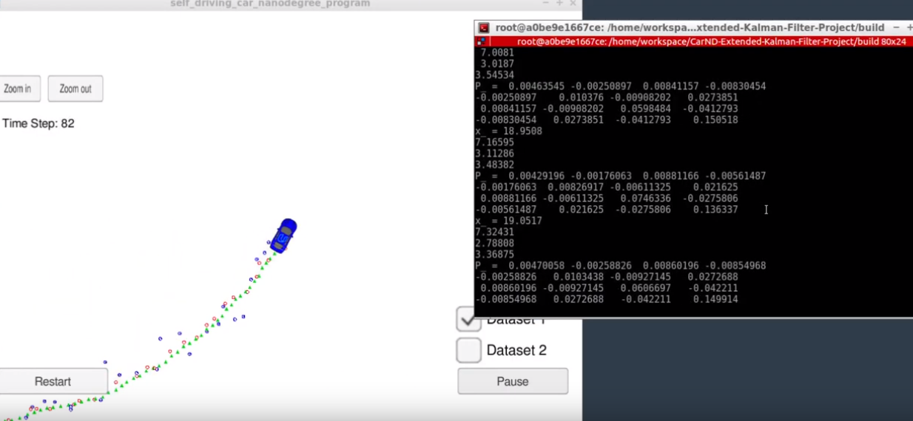

# Extended Kalman Filter Project

|Extended Kalman Filter Results|
|[](https://www.youtube.com/watch?v=SWhRtXtzudw)


Self-Driving Car Engineer Nanodegree Program

In this project I have utilized a kalman filter to estimate the state of a moving object of interest with noisy lidar and radar measurements. Passing the project requires obtaining RMSE values that are lower than the tolerance outlined in the project rubric. 

This project involves the Term 2 Simulator which can be downloaded [here](https://github.com/udacity/self-driving-car-sim/releases)

This repository includes two files that can be used to set up and install [uWebSocketIO](https://github.com/uWebSockets/uWebSockets) for either Linux or Mac systems. For windows you can use either Docker, VMware, or even [Windows 10 Bash on Ubuntu](https://www.howtogeek.com/249966/how-to-install-and-use-the-linux-bash-shell-on-windows-10/) to install uWebSocketIO. Please see the uWebSocketIO Starter Guide page in the classroom within the EKF Project lesson for the required version and installation scripts.

Once the install for uWebSocketIO is complete, the main program can be built and run by doing the following from the project top directory.

1. mkdir build
2. cd build
3. cmake ..
4. make
5. ./ExtendedKF

Note that the programs that need to be written to accomplish the project are src/FusionEKF.cpp, src/FusionEKF.h, kalman_filter.cpp, kalman_filter.h, tools.cpp, and tools.h

** For reference regarding the math behing Extended Kalman Filter** : [refference](https://github.com/Ceachi/Project-Self-Driving-Extended-Kalman-Filter/blob/master/Documentation/sensor-fusion-ekf-reference.pdf)
---

## Other Important Dependencies

* cmake >= 3.5
  * All OSes: [click here for installation instructions](https://cmake.org/install/)
* make >= 4.1 (Linux, Mac), 3.81 (Windows)
  * Linux: make is installed by default on most Linux distros
  * Mac: [install Xcode command line tools to get make](https://developer.apple.com/xcode/features/)
  * Windows: [Click here for installation instructions](http://gnuwin32.sourceforge.net/packages/make.htm)
* gcc/g++ >= 5.4
  * Linux: gcc / g++ is installed by default on most Linux distros
  * Mac: same deal as make - [install Xcode command line tools](https://developer.apple.com/xcode/features/)
  * Windows: recommend using [MinGW](http://www.mingw.org/)
 * Optional Resources
  * A [Sensor Fusion utilities repo](https://github.com/udacity/CarND-Mercedes-SF-Utilities)  containing Matlab scripts that will generate more sample data (generating your own sample data is completely optional)
  * A visualization package that you can also find within the [Sensor Fusion utilities repo](https://github.com/udacity/CarND-Mercedes-SF-Utilities)
  

## Basic Build Instructions

1. Clone this repo.
2. Make a build directory: `mkdir build && cd build`
3. Compile: `cmake .. && make` 
   * On windows, you may need to run: `cmake .. -G "Unix Makefiles" && make`
4. Run it: `./ExtendedKF `

## Environment Setup (Windows)
The tips below may be helpful in setting up your environment and getting term 2 projects up and running. Windows 10 Users please note that Ubuntu BASH is the recommended option<br>

**STEPS:** <br>
* Ensure all dependencies are present per project resources
* Follow these the instructions in the uWebSocketIO starter guide which includes instructions for setting up Ubuntu BASH.
* open Ubuntu Bash and clone the project repository
* on the command line execute ./install-ubuntu.sh
* build and run according to the instructions in the project repository README

**Trouble Shooting**
* .sh files not recognized on run: Try chmod a+x <filename.sh> for example chmod a+x install-ubuntu.sh
* Messages regarding 404s, missing resources, and a variety of other error messages can be addressed by updates and other means, per this [Knowledge post](https://knowledge.udacity.com/questions/5184). The general steps are:   
* Not all steps will be necessary, for example, installing git and cloning the project repository, if this has already been done.    
1. sudo apt-get update  
2. sudo apt-get install git  
3. sudo apt-get install cmake  
4. sudo apt-get install openssl  
5. sudo apt-get install libssl-dev  
6. git clone https://github.com/Ceachi/Project-Self-Driving-Extended-Kalman-Filter  
7. sudo rm /usr/lib/libuWS.so  
8. navigate to CarND-Kidnapped-Vehicle-Project/  
9. ./install-ubuntu.sh  
10. at the top level of the project repository mkdir build && cd build  
11. from /build cmake .. && make  
12. Launch the simulator from Windows and execute the run command for the project, for example **./ExtendedKF or ./particle_filter** (Make sure you also run the simulator on the Windows host machine) If you see this message, it is working **Listening to port 4567**
After following these steps there may be some messages regarding makefile not found or can't create symbolic link to websockets. There is likely nothing wrong with the installation. Before doing any other troubleshooting make sure that steps 10 and 11 have been executed from the top level of the project directory, then test the installation using step 12.  
**Step 9 may fail for number of rasons as listed below:**  

* **install-ubuntu.sh** has only rw but no x permission. Run chmod a+x install-ubuntu.sh to give execution permission  
* Cannot find the package **libuv1-de**  
   * To install the package run **sudo apt-get install libuv1.dev**
   * If you still cannot install the package run the following to get the package and install it:  
     * sudo add-apt-repository ppa:acooks/libwebsockets6
     * sudo apt-get update
     * sudo apt-get install libuv1.de
   * May complain about the version of cmake you have. You need a version greater than 3.0. [Here is a link](https://askubuntu.com/questions/355565/how-do-i-install-the-latest-version-of-cmake-from-the-command-line)  which describes how to get version 3.8. Look at Teocci's response in this link
   * Installing cmake requires g++ compiler. Install a g++ version 4.9 or greater. Here are the step  
     * sudo add-apt-repository ppa:ubuntu-toolchain-r/test
     * sudo apt-get update
     * sudo apt-get install g++-4.9
  * **A Note Regarding Step 11** This step can fail if the bash shell is still referring to an older g++ version. To address this, please refer to this [Ask Ubuntu post](https://askubuntu.com/questions/428198/getting-installing-gcc-g-4-9-on-ubuntu/507068#507068).

**Connected!!!
## Code Style

Please (do your best to) stick to [Google's C++ style guide](https://google.github.io/styleguide/cppguide.html).

## Generating Additional Data

This is optional!

If you'd like to generate your own radar and lidar data, see the
[utilities repo](https://github.com/udacity/CarND-Mercedes-SF-Utilities) for
Matlab scripts that can generate additional data.

### Extended Kalman Filter Simulator
1. In the main menu screen select Project 1/2 EKF and UKF. <br>
2. Once the scene is loaded you can hit the START button to observe how the object moves and how measurement markers are positioned in the data set. Also for more experimentation, "Data set 2" is included which is a reversed version of "Data set 1", also the second data set starts with a radar measurement where the first data set starts with a lidar measurement. At any time you can press the PAUSE button, to pause the scene or hit the RESTART button to reset the scene. Also, the ARROW KEYS can be used to move the camera around, and the top left ZOOM IN/OUT buttons can be used to focus the camera. Pressing the ESCAPE KEY returns to the simulator main menu.<br>

**NOTES:** <br>
* Currently hitting Restart or switching between data sets only refreshes the simulator state and not the Kalman Filter's saved results. The current procedure for refreshing the Kalman Filter is to close the connection, ctrl+c and reopen it, ./ExtendedKF. If you don't do this when trying to run a different data set or running the same data set multiple times in a row, the RMSE values will become large because of the previous different filter results still being observed in memory.
* The two functions in tools.cpp need to be implemented for the simulator to avoid throwing a segmentation fault - make sure to get those built out in order to test in the simulator!
## Project Instructions and Rubric

Note: regardless of the changes you make, your project must be buildable using
cmake and make!

More information is only accessible by people who are already enrolled in Term 2
of CarND. If you are enrolled, see [the project resources page](https://classroom.udacity.com/nanodegrees/nd013/parts/40f38239-66b6-46ec-ae68-03afd8a601c8/modules/0949fca6-b379-42af-a919-ee50aa304e6a/lessons/f758c44c-5e40-4e01-93b5-1a82aa4e044f/concepts/382ebfd6-1d55-4487-84a5-b6a5a4ba1e47)
for instructions and the project rubric.


## Data file for EKF project
* The github repo contains one data file: [data](https://github.com/Ceachi/Project-Self-Driving-Extended-Kalman-Filter/blob/master/data/obj_pose-laser-radar-synthetic-input.txt). The simulator will be using this data file, and feed main.cpp values from it one line at a time. Each row represents a sensor measurement where the first column tells you if the measurement comes from radar (R) or lidar (L).<br/>
* For a row containing radar data, the columns are: sensor_type, rho_measured, phi_measured, rhodot_measured, timestamp, x_groundtruth, y_groundtruth, vx_groundtruth, vy_groundtruth, yaw_groundtruth, yawrate_groundtruth.<br/>
* For a row containing lidar data, the columns are: sensor_type, x_measured, y_measured, timestamp, x_groundtruth, y_groundtruth, vx_groundtruth, vy_groundtruth, yaw_groundtruth, yawrate_groundtruth.<br/>
* Whereas radar has three measurements (rho, phi, rhodot), lidar has two measurements (x, y).<br/>
You will use the measurement values and timestamp in your Kalman filter algorithm. Groundtruth, which represents the actual path the bicycle took, is for calculating root mean squared error.<br/>
* You do not need to worry about yaw and yaw rate ground truth values.<br/>
We have provided code that will read in and parse the data files for you. This code is in the main.cpp file. The main.cpp file creates instances of a MeasurementPackage.<br/>
If you look inside 'main.cpp', you will see code like:<br/>
```cpp
MeasurementPackage meas_package;
meas_package.sensor_type_ = MeasurementPackage::LASER;
meas_package.raw_measurements_ = VectorXd(2);
meas_package.raw_measurements_ << px, py;
meas_package.timestamp_ = timestamp;
``` 
and  
```cpp
vector<VectorXd> ground_truth;
VectorXd gt_values(4);
gt_values(0) = x_gt;
gt_values(1) = y_gt; 
gt_values(2) = vx_gt;
gt_values(3) = vy_gt;
ground_truth.push_back(gt_values);
```
The code reads in the data file line by line. The measurement data for each line gets pushed onto a "measurement_pack_list". The ground truth [px, py, vx, vy] for each line in the data file gets pushed onto "ground_truth" so RMSE can be calculated later for "tools.cpp". <br>

## File Structure
The three main steps for programming a Kalman filter:<br>
 1) **initializing** Kalman filter variables  
 2) **predicting** where our object is going to be after a time step (delta_t)  
 3) **updating** where our object is based on sensor measurements<br>
Then the prediction and update steps repeat themselves in a loop.
To measure how well our Kalman filter performs, we will then calculate **root mean squared error** comparing the Kalman filter results with the provided ground truth.
These three steps (initialize, predict, update) plus calculating RMSE encapsulate the entire extended Kalman filter project.

The files you need to work with are in the src folder of the github repository:
* **main.cpp** - communicates with the Term 2 Simulator receiving data measurements, calls a function to run the Kalman filter, calls a function to calculate RMSE
* **FusionEKF.cpp** - initializes the filter, calls the predict function, calls the update function
* **kalman_filter.cpp** -  defines the predict function, the update function for lidar, and the update function for radar
* **tools.cpp** - function to calculate RMSE and the Jacobian matrix
The only files where you will se the Extended Kalman Filter algorithm are: FusionEKF.cpp, kalman_filter.cpp and tools.cpp <br>

**HOW THE FILES RELATED TO EACH OTHER** <br>
Here is a brief overview of what happens when you run the code files:<br>
1) **Main.cpp** reads in the data and sends a sensor measurement to FusionEKF.cpp
2) **FusionEKF.cpp** takes the sensor data and initializes variables and updates variables. The Kalman filter equations are not in this file. **FusionEKF.cpp** has a variable called **ekf_**, which is an instance of a **KalmanFilter** class. The **ekf_** will hold the matrix and vector values. You will also use the **ekf_** instance to call the predict and update equations.<br>
3)The **KalmanFilter** class is defined in **kalman_filter.cpp** and **kalman_filter.h**. You will only need to modify 'kalman_filter.cpp', which contains functions for the prediction and update steps.

**Main.cpp**
The Term 2 simulator is a client, and the c++ program software is a web server.<br>
We already discussed how main.cpp reads in the sensor data. Recall that main.cpp reads in the sensor data line by line from the client and stores the data into a measurement object that it passes to the Kalman filter for processing. Also a ground truth list and an estimation list are used for tracking RMSE.<br>
**main.cpp** is made up of several functions within main(), these all handle the uWebsocketIO communication between the simulator and it's self.
Here is the main protocol that main.cpp uses for uWebSocketIO in communicating with the simulator.<br>
```cpp
INPUT: values provided by the simulator to the c++ program

["sensor_measurement"] => the measurement that the simulator observed (either lidar or radar)


OUTPUT: values provided by the c++ program to the simulator

["estimate_x"] <= kalman filter estimated position x
["estimate_y"] <= kalman filter estimated position y
["rmse_x"]
["rmse_y"]
["rmse_vx"]
["rmse_vy"]
```
<br>
All the main code loops in **h.onMessage()**, to have access to intial variables that we created at the beginning of **main()**, we pass pointers as arguments into the header of **h.onMessage()**.<br>
For Example:
```cpp
h.onMessage([&fusionEKF,&tools,&estimations,&ground_truth]
            (uWS::WebSocket<uWS::SERVER> ws, char *data, size_t length, 
             uWS::OpCode opCode)
```
The rest of the arguments in **h.onMessage** are used to set up the server.<br>

The code is: <br>
 * creating an instance of the FusionEKF class
 * Receiving the measurement data calling the ProcessMeasurement() function. ProcessMeasurement() is responsible for the initialization of the Kalman filter as well as calling the prediction and update steps of the Kalman filter. You will be implementing the ProcessMeasurement() function in FusionEKF.cpp: <br>
Finally <br>
The rest of **main.cpp** will output the following results to the simulator: <br>
* estimation position
* calculated RMSE

**main.cpp** will call a function to calculate root mean squared error:
```cpp
  // compute the accuracy (RMSE)
  Tools tools;
  cout << "Accuracy - RMSE:" << endl << tools.CalculateRMSE(estimations, ground_truth) << endl;
```
## Good references/ Tutorials about Kalman Filter/Extendended Kalman Filter
* Understanding Kalman filters tutorial: https://www.youtube.com/watch?v=mwn8xhgNpFY&t=4s  

Here are some useful materials/video about Kalman Filters, if you want to deepen your knowledge:
https://fr.mathworks.com/videos/understanding-kalman-filters-part-1-why-use-kalman-filters--1485813028675.html  
http://www.bzarg.com/p/how-a-kalman-filter-works-in-pictures/#mathybits  
https://www.youtube.com/watch?v=CaCcOwJPytQ&list=PLX2gX-ftPVXU3oUFNATxGXY90AULiqnWT  


**Tips after the review of the project**:  

This is mostly a "code smell" test. Your algorithm does not need to sacrifice comprehension, stability, robustness or security for speed, however it should maintain good practice with respect to calculations.

Here are some things to avoid. This is not a complete list, but rather a few examples of inefficiencies.

* Running the exact same calculation repeatedly when you can run it once, store the value and then reuse the value later.
* Loops that run too many times.
* Creating unnecessarily complex data structures when simpler structures work equivalently.
* Unnecessary control flow checks.


## How to write a README
A well written README file can enhance your project and portfolio.  Develop your abilities to create professional README files by completing [this free course](https://www.udacity.com/course/writing-readmes--ud777).

